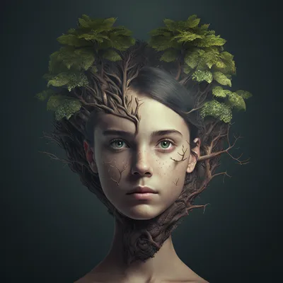
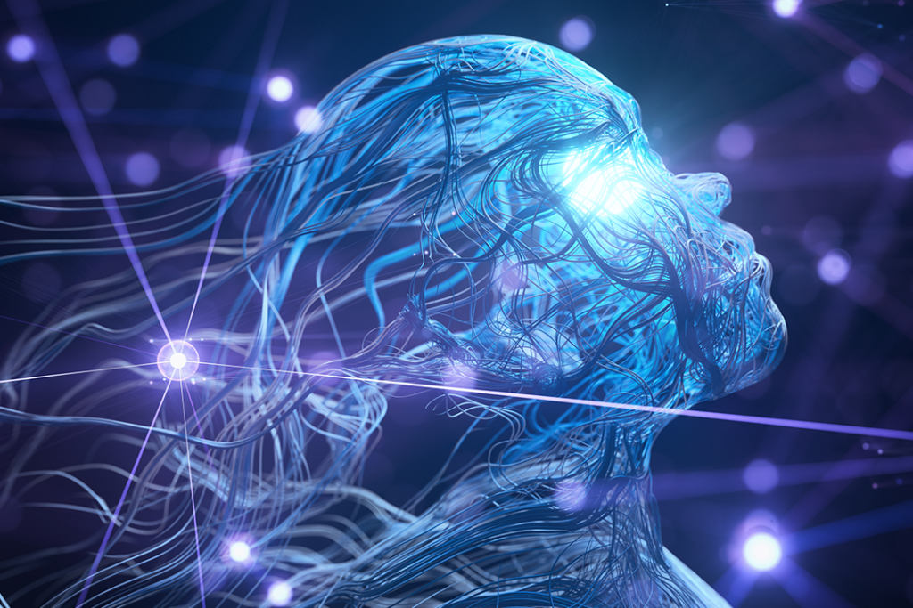

# Direitos autorais nas Inteligências Artificiais 

Direitos autorais nas inteligências artificiais (IAs) é um tema complexo em evolução que vem causando certas dúvidas na sociedade, pois se trata sobre a evolução constante das máquinas, podendo ser meio preocupante. Aqui está uma visão geral dos principais pontos abordados sobre este tema:

## 1. Criação e Titularidade

- Obra Original: Tradicionalmente, direitos autorais protegem obras originais criadas por autores humanos. Para que uma obra seja protegida, ela deve ser uma criação original e ter um mínimo de criatividade.

- Obras Criadas por IAs: Quando uma IA gera uma obra (por exemplo, um texto, uma imagem, uma música), a questão de quem detém os direitos autorais torna-se mais complicada. Em muitos países, a proteção por direitos autorais é __concedida apenas a autores humanos__, portanto, obras criadas exclusivamente por IAs podem não estar automaticamente protegidas.

## 2. Autoria Humana

- Obras Colaborativas: Se uma IA é usada como uma ferramenta ou colaboradora na criação de uma obra, a autoria pode ser atribuída ao humano que utilizou a IA, especialmente se esse humano fez contribuições significativas ao processo criativo.

- Programadores e Usuários: Em casos onde a IA é desenvolvida e programada para criar conteúdo, os direitos autorais podem ser atribuídos ao criador da IA (ou seja, o programador ou desenvolvedor da IA) ou à pessoa que utilizou a IA para criar a obra, dependendo do nível de envolvimento humano no processo criativo.

## 3. Legislação e Regulações

- Variações Nacionais: As leis de direitos autorais variam entre países. Alguns podem ter abordagens específicas ou emergentes sobre a autoria de obras geradas por IAs. A legislação ainda está se adaptando para lidar com as novas realidades da tecnologia.

- Desenvolvimentos Recentes: Em alguns países, estão sendo discutidas e implementadas mudanças nas leis de direitos autorais para abordar diretamente a criação de obras por IAs, incluindo debates sobre a necessidade de novas categorias de proteção ou ajustes nas definições de autoria.

## 4.Impacto no Mercado

- Propriedade Intelectual: A questão dos direitos autorais em relação às IAs pode impactar a propriedade intelectual, licenciamento e monetização de obras criadas por IA, criando novas dinâmicas e desafios para criadores e desenvolvedores.

## 5. Exemplos e Casos

- Casos Legais: Alguns casos legais estão começando a surgir, abordando como os direitos autorais devem ser aplicados a obras criadas por IAs. Estes casos podem ajudar a moldar precedentes e orientações futuras.

A legislação e a regulamentação estão em constante evolução para acompanhar os avanços tecnológicos. Portanto, é importante acompanhar as mudanças e buscar orientação legal específica quando se trata de direitos autorais relacionados a IAs.

# Como são criadas essas obras?

As obras são criadas com o auxílio de uma ferramenta presente nas IAs, chamada __Midjourney__.

## O que é o Midjourney?

O Midjourney é uma ferramenta de inteligência artificial projetada para criar imagens a partir de descrições textuais. Funciona de maneira semelhante a outros geradores de arte baseados em IA, como o DALL-E e o Stable Diffusion. Usuários fornecem descrições detalhadas e a IA transforma essas descrições em imagens visuais. O Midjourney é conhecido por sua capacidade de gerar arte com um estilo artístico único e é popular entre designers e criadores que buscam inspiração ou precisam de visuais rápidos para projetos criativos. A ferramenta geralmente é acessada através de uma plataforma de chat, como o Discord.

## Algumas imagens criadas com o auxílio desta ferramenta:

# Considerações finais:

A interação entre direitos autorais e IA exige um equilíbrio cuidadoso entre incentivar a inovação e proteger os interesses dos criadores. A legislação e as práticas de direitos autorais precisam evoluir para abordar os desafios apresentados pela IA, garantindo que a proteção legal continue a apoiar a criatividade e a inovação sem sufocar o progresso tecnológico.

